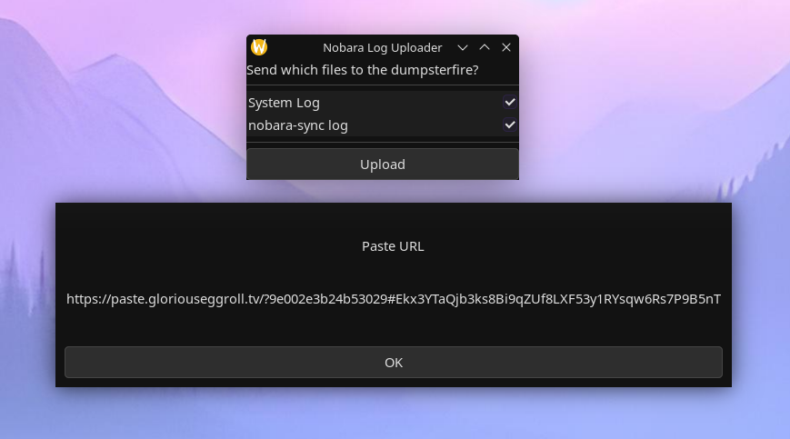

A GUI tool to make uploading logs easier for Nobara users. 

Work in progress... 

ToDo:

* Get the "OK" button to close the dialog
* Refine what journal entries get captured
* Change how logs are passed to pbcli 

